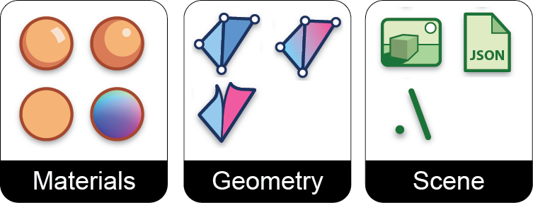

# Triceratops

Triceratops is a Grasshopper plugin that exports geometry from Grasshopper to a JSON file in the Three.js object scene format.

## Goals

Triceratops is a Grasshopper exporter made for web developers that use Three.js. Therefore, the intention is to create a Grasshopper plugin that exposes the Three.js object classes and their attributes while using terminology the mirrors that of Three.js. Many components, therefore, which represent specific Three.js object classes in both name and attributes. For instance, the component [MeshStandardMaterial](https://threejs.org/docs/#api/en/materials/MeshStandardMaterial) allows the user to create an object of this class and associate it a mesh object.

## Output

The plugin produces as a JSON with using the [Three.js object scene format](https://github.com/mrdoob/three.js/wiki/JSON-Object-Scene-format-4). 

## Loading 

The resulting JSON objects can be loaded into a Three.js canvas using [THREE.ObjectLoader()](https://threejs.org/docs/#api/en/loaders/ObjectLoader).

## Tools

## Geometry

Currently, only meshes are supported. The exporter uses the [bufferGeometry](https://threejs.org/docs/#api/en/core/BufferGeometry) format for meshes.

## Development Environment

The plugin was developed in Visual Studio using the [Grasshopper plugin template](https://marketplace.visualstudio.com/items?itemName=McNeel.GrasshopperAssemblyforv6). The [Visual Studio project folder](https://github.com/meliharvey/Triceratops/tree/master/threejs-exporter) is included in this repository.

## Next steps

* line geometry
* meshPhongMaterial
* meshLambertMaterial
