# Triceratops

Triceratops is a Grasshopper plugin that exports geometry from Grasshopper to a JSON file in the Three.js object scene format.

## Goals

Triceratops is a Grasshopper exporter made for web developers that use Three.js. Therefore, the intention is to create a Grasshopper plugin that exposes the Three.js object classes and their attributes while using terminology the mirrors that of Three.js. Many components represent specific Three.js object classes in both name and attributes. For instance, the component [MeshStandardMaterial](https://threejs.org/docs/#api/en/materials/MeshStandardMaterial) allows the user to create an object of this class and associate it a mesh object.

## Acknowledgement
This project was built with support from Kohn Pedersen Fox Associates PC.

## Install

* Go to [Triceratops page at Food4Rhino](https://www.food4rhino.com/app/triceratops) and download the project .zip folder.
* Extract the files from the .zip folder.
* Place the .gha file in your grasshopper components folder. This can be found from Grasshopper at:
  File > Special Folders > Components Folder

  or often at the following location on your C drive:
  C:\Users\[your username]\AppData\Roaming\Grasshopper\Libraries
* Restart, or start a new instance of Rhino/Grasshopper

## Output

The plugin produces as a JSON with using the [Three.js object scene format](https://github.com/mrdoob/three.js/wiki/JSON-Object-Scene-format-4). The resulting JSON objects can be loaded into a Three.js canvas using [THREE.ObjectLoader()](https://threejs.org/docs/#api/en/loaders/ObjectLoader).

## Supported Geometry

Meshes, lines, and points are supported. The exporter uses the [bufferGeometry](https://threejs.org/docs/#api/en/core/BufferGeometry) format for defining geometry. All meshes use face indexing.

## Tools

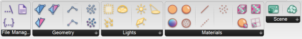

**Geometry**
* 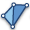 **Mesh** builds a Three.js mesh object with associated bufferGeometry. If no material is defined Three.js will automatically assign MeshBasicMaterial.
* 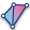 **MeshVertexColors** builds a Three.js mesh object with vertex colors.
*  **Color Mesh Faces** unwelds all mesh edges and colors vertices based on mesh faces.
* 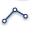 **Line** builds a Three.js line object and associated bufferGeometry. If no material is defined Three.js will automatically assign LineBasicMaterial.
* 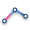 **LineVertexColor**  creates a Three.js line object that uses vertex colors.
* 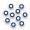 **Points** creates a Three.js points object with associated bufferGeometry. If no material is specified, Three.js will assign PointsMaterial on load.
* 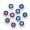 **PointsVertexColors** creates a Three.js points object where each point can be given a custom color. If no material is specified, Three.js will assign PointsMaterial on load.
* 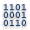 **UserData** creates an object consisting of custom key, value pairs that can be attached to geometry using threejs' userData property.

**Materials**
* 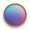 **MeshNormalMaterial** creates a Three.js material object of the MeshNormalMaterial type. This material colors mesh faces based on their normal.
*  **MeshBasicMaterial** creates a Three.js material object of the MeshBasicMaterial type. This material gives a mesh a solid color that does not react to scene lighting or shadows.
*  **MeshStandardMaterial** creates a Three.js material object of the MeshStandardMaterial class. This material uses physically based rendering to make a material that reacts to light in a realistic way.
* 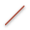 **LineBasicMaterial** creates a Three.js material object of the LineBasicMaterial class. This material can define a solid color for the line.
* 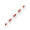 **LineDashedMaterial** creates a Three.js material object of the LineDashedMaterial class. This material can define a dot-dash pattern for the line.
*  **PointsMaterial** creates a PointsMaterial Three.js object. This material can be applied to Points geometry.

**Textures**
*  **Texture** creates a Three.js Texture object.
*  **CubeTexture** creates a Three.js CubeTexture object. This can be used to define a scenes background.
*  **Image Settings** allows you to change the saturation, contrast, and lightness of an image.
*  **Texture Settings** creates a Three.js
*  **MeshStandardMaterial Maps** allows a user to define texture maps for MeshStandardMaterial.

**Lighting**
* 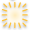 **AmbientLight** creates a Three.js AmbientLight object.
*  **HemisphereLight** creates a Three.js HemisphereLight object.
*  **DirectionalLight** creates a Three.js DirectionalLight object. Because of limitations with the Three.js ObjectLoader, the directional light's target is always set to the origin.
*  **SpotLight** creates a Three.js SpotLight object. Because of limitations with the Three.js ObjectLoader, the spotlight's target is always set to the origin.
*  **PointLight** creates a Three.js PointLight object.
*  **RectAreaLight** creates a Three.js RectAreaLight object.

**Scene**
*  **Scene** creates a Scene object from one or more mesh geometries.
* 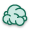 **Fog** creates a Fog object.

**File Management**
*  **WriteTextFile** writes a text file to a specific location.
*  **ExportJSON** creates a JSON string from any Three.js Object3d.
*  **RelativePath** generates the file path to the location where the grasshopper is saved.

## Example Scene

The example scene demonstrates how to export meshes with various materials and settings.

## Chair

This example demonstrates some basic texture mapping.

## House

This example shows how various geometry types and lighting can work together to create an architectural scene.

## Development Environment

The plugin was developed in Visual Studio using the [Grasshopper plugin template](https://marketplace.visualstudio.com/items?itemName=McNeel.GrasshopperAssemblyforv6). The [Visual Studio project folder](https://github.com/meliharvey/Triceratops/tree/master/threejs-exporter) is included in this repository.

## Next steps
* Automatically produce entire viewer website as index.html
* Sprites
* Geometry primitives (box, sphere, cone, etc.)
* 2 sided materials
* optional face indexing for meshes
* meshLines
* fat Lines
* animate objects using GH slider to control the frames
* clipping plane
* depth texture
* shaders
