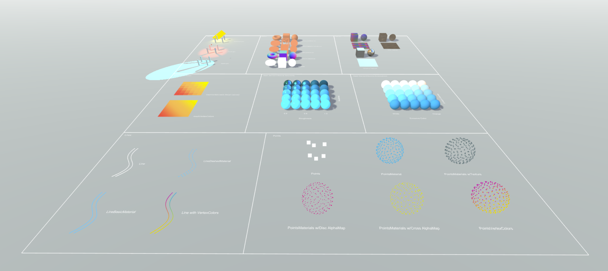
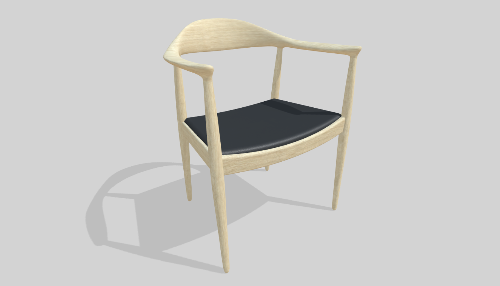
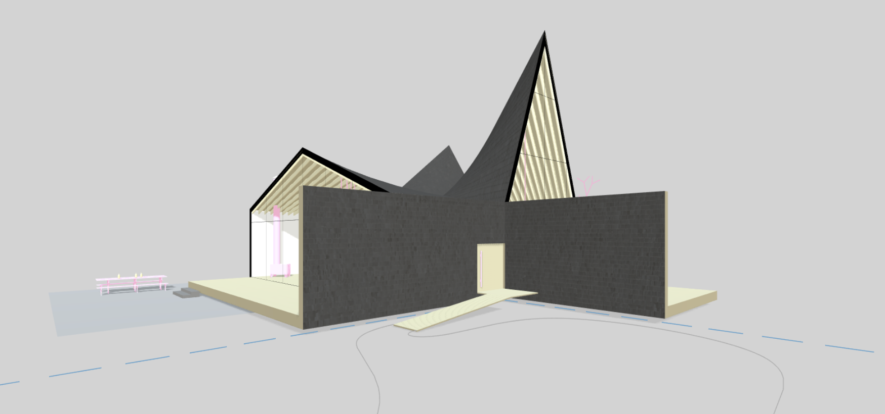

# Examples

The following example scenes are set up in Rhino/Grasshopper to export 3d model JSON files to the example website located in the subfolder ```www```. This simple website can be served locally for testing what the finished 3d model looks like rendered on the three.js canvas.

Thanks [texturehaven.com](https://texturehaven.com/) for supplying the free PBR textures.

## Example Scene

The example scene demonstrates how to export meshes with various materials and settings.



## Chair

This example demonstrates some basic texture mapping.



## House

This example shows how various geometry types and lighting can work together to create an architectural scene.


